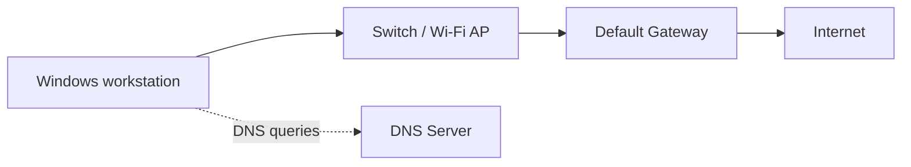

# Network Diagram

Reference topology used by the scenarios in this lab.

```mermaid
flowchart LR
    PC[Windows workstation]
    SW[Switch / Wi-Fi AP]
    GW[Default Gateway]
    DNS[DNS Server]
    ISP[Internet]

    PC --> SW
    SW --> GW
    PC -. DNS queries .-> DNS
    GW --> ISP
```

The diagram is intentionally simple: the objective is to visualize the path a support technician tests.
